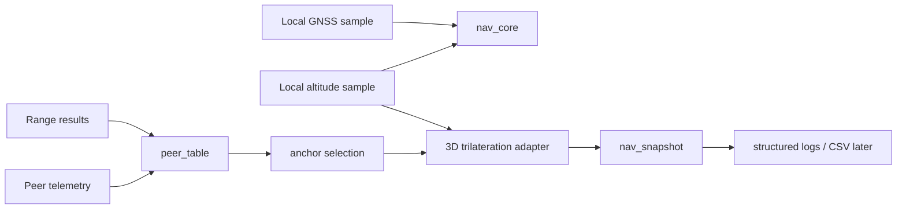

# Architecture

## Purpose

This repository is the main MCU navigation brain for group UAV navigation. It
keeps navigation decisions portable and testable while hardware-specific work
stays in `ports/` or future repositories.

## Belongs Here

- Navigation state machine and solution acceptance/rejection.
- Peer telemetry and range state.
- Anchor selection and v1 geometry diagnostics.
- Trilateration adapter using the validated reference project.
- Structured logs, snapshots, host tests, replay/simulation plans, and docs.
- Host-side contract for the future radio coprocessor protocol.

## Does Not Belong Here

- ESP8285/SX1280 radio firmware.
- SX1280 SPI drivers or RF timing code.
- ESP-IDF, STM32 HAL, Arduino, FreeRTOS, POSIX, or UART dependencies in `core/`.
- Flight-controller integration beyond future output abstractions.

## Implemented Solve Path

When local GNSS is usable and forced-denied mode is off, the snapshot is
`GNSS_DIRECT`. Otherwise the core attempts radio navigation from exactly three
usable anchors and a fresh local altitude sample.

## Portable Core Vs Ports

`core/` is plain C11. Callers inject `nav_event_t`; the core owns `nav_system_t`
state and returns `nav_snapshot_t`. Ports translate drivers, timers, CLI input,
or replay files into events and transport logs/snapshots to platform sinks.

`nav_system_t` is public so embedded applications can allocate it statically.
Application code should normally interact through `nav_core_handle_event()`,
`nav_core_tick()`, and `nav_core_get_snapshot()`. Direct mutation of fields such
as peer table, local GNSS, local altitude, mode, or snapshot is reserved for
tests and low-level diagnostic tools.

## Radio Coprocessor Boundary

The radio/ranging coprocessor owns RF and ranging mechanics. The main MCU owns
GNSS validity, peer table, anchor selection, trilateration, state decisions,
logs, snapshots, and future FC output. The coprocessor firmware is a separate
future repository.
