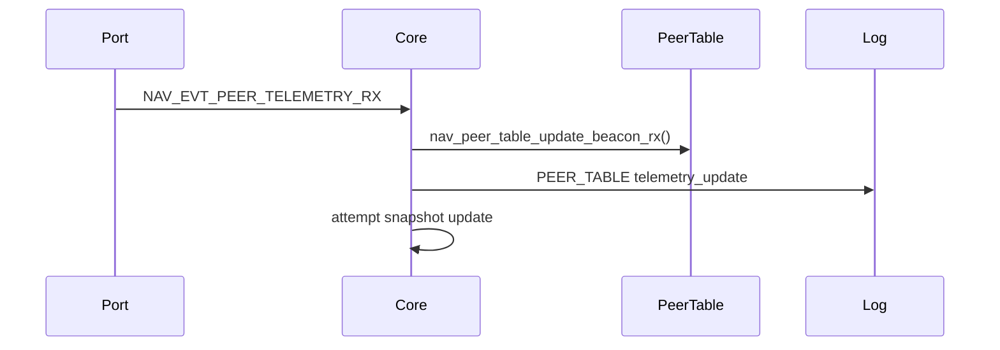
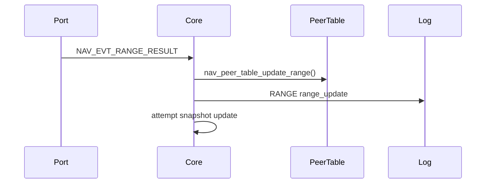
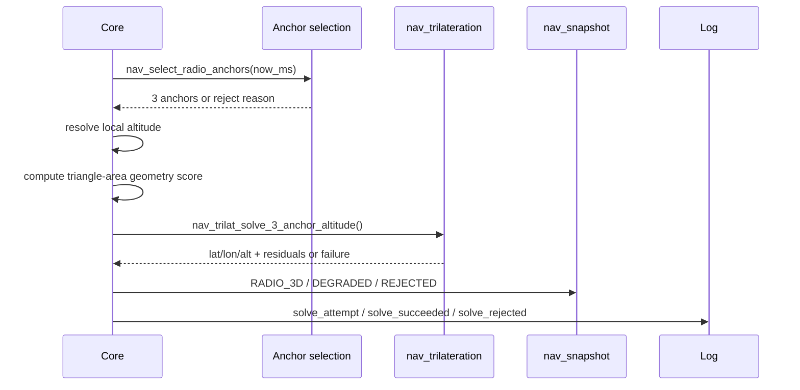
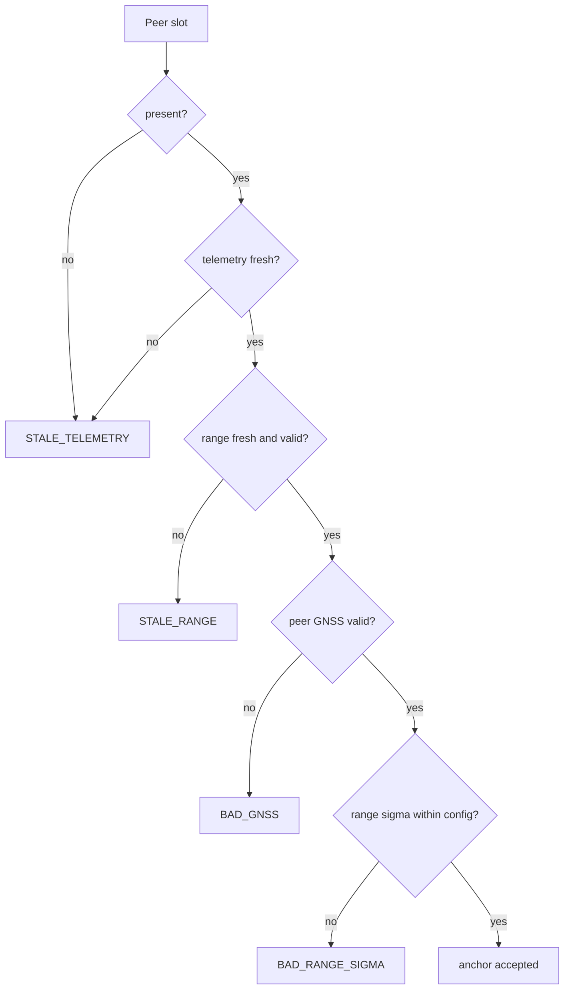
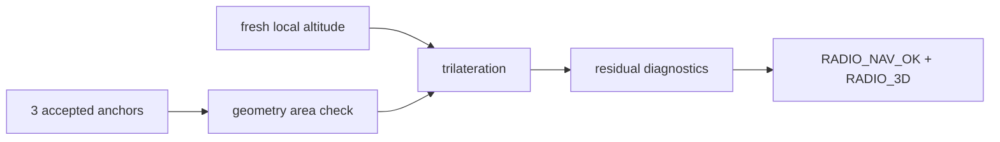
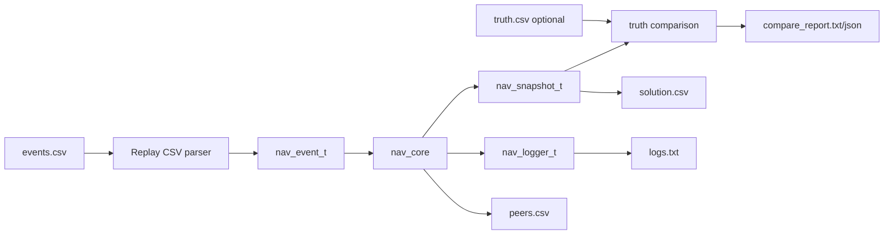
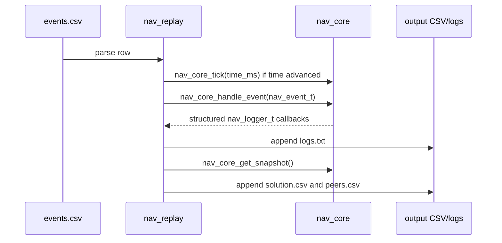

# Data Flow

The core receives explicit events and emits snapshots/logs. It does not poll
drivers or own platform resources.

## Telemetry Update

`NAV_EVT_PEER_TELEMETRY_RX` carries `nav_peer_beacon_rx_t`: peer telemetry from
the remote node plus local receive metadata (`rssi_dbm`, `snr_db`).

## Range Update

## Radio Navigation Solve Attempt

## Anchor Rejection Path

## Successful Solution Path

## Replay Flow

`nav_replay` is a host-side tool. It owns CSV parsing, file I/O, output
directories, and replay logs. The portable core still only sees `nav_event_t`
values and emits snapshots/log callbacks.

Replay emits `solution.csv` and `peers.csv` after every processed input row.
Parser errors include the input line number and return a nonzero exit code.
When `truth.csv` exists, replay compares exact `(time_ms,node_id)` solution rows
against truth and writes comparison reports. It does not interpolate.

## Replay Event Sequence

`packet_seq` in replay input is the remote peer beacon sequence. `request_id` is
the ranging correlation id. Replay row order is only file order.
