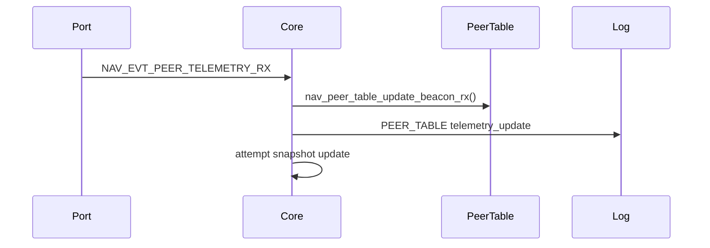
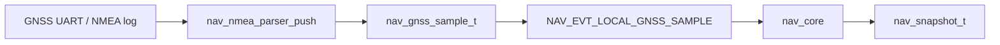
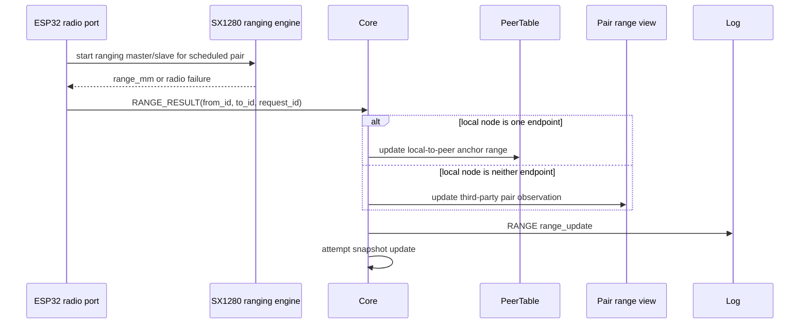
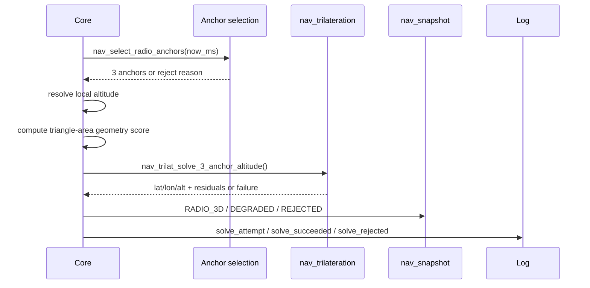
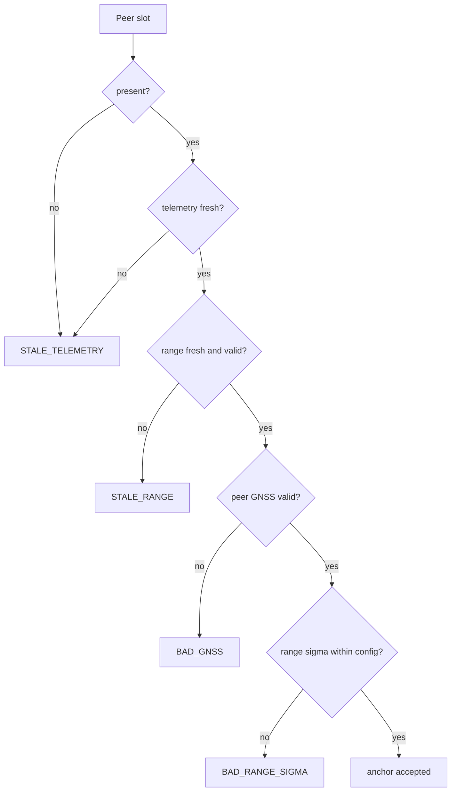
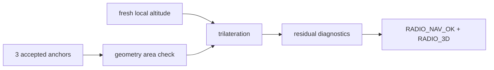
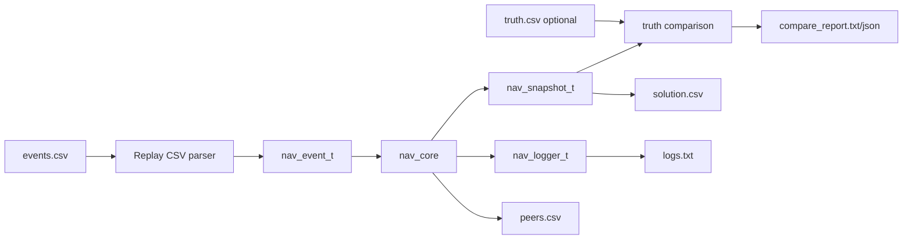
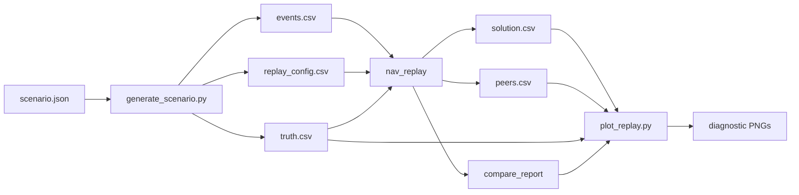
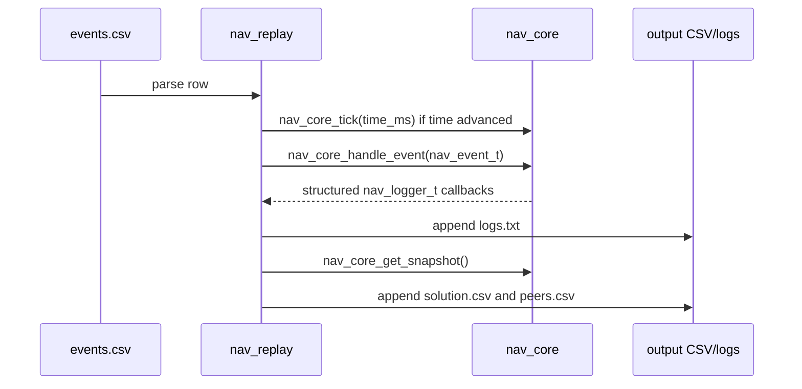

# Data Flow

The core receives explicit events and emits snapshots/logs. It does not poll
drivers or own platform resources.

## Telemetry Update

`NAV_EVT_PEER_TELEMETRY_RX` carries `nav_peer_beacon_rx_t`: peer telemetry from
the remote node plus local receive metadata (`rssi_dbm`, `snr_db`).

## Local GNSS NMEA Update

Future UART ports feed bytes into the portable NMEA parser and wrap emitted
samples as normal core events. The parser does not own the UART or clock; the
adapter stamps `timestamp_ms` with local system/replay time before injection.

When `demo_force_gps_denied` is true, the core stores/logs local GNSS samples
but does not use them as `NAV_SOURCE_LOCAL_GNSS`.

## Range Update

Distance measurements are produced by the SX1280 ranging engine in a scheduled
TDMA ranging slot. The platform radio driver converts the readable ranging
result into a range event. The current host/replay event uses an implicit local
endpoint plus `peer_id`; the ESP32 TDMA integration must carry explicit
`from_id` / `to_id` endpoints so third-party pair ranges can be displayed by the
control app. RSSI/SNR remain diagnostics; they are not distance inputs.

Third-party pair observations are for network health, diagnostics, replay, and
`control-app/`. They do not make a peer usable as an anchor for the local solver
unless one endpoint of the range is the local node.

The current ESP32 distance-only firmware implements this as a bring-up path:
after each local SX1280 ranging attempt, the ranging master broadcasts a compact
best-effort `range_result` text report. Nodes that hear it log the same
endpoint-bearing observation with `source=air_report`, allowing the control app
connected to one node to show pairs measured by other nodes. This report path is
diagnostic only and is not the final replay/core endpoint-bearing contract.

## Radio Navigation Solve Attempt

## Anchor Rejection Path

## Successful Solution Path

## Replay Flow

`nav_replay` is a host-side tool. It owns CSV parsing, file I/O, output
directories, and replay logs. The portable core still only sees `nav_event_t`
values and emits snapshots/log callbacks.

Replay emits `solution.csv` and `peers.csv` after every processed input row.
Parser errors include the input line number and return a nonzero exit code.
When `truth.csv` exists, replay compares exact `(time_ms,node_id)` solution rows
against truth and writes comparison reports. It does not interpolate.

## Simulation And Plot Flow

The simulator layer is outside `core/` and outside `nav_replay`. It generates
deterministic replay inputs, then the existing replay runner remains the path
that drives the navigation core for offline scenario results.

`tools/sim/generate_scenario.py` writes `events.csv`, `truth.csv`,
`replay_config.csv`, and `scenario_resolved.json`. Optional seeded range noise,
explicit packet drops, and local-altitude cadence are deterministic.
`tools/plot/plot_replay.py` reads only replay-visible files: `truth.csv`,
`solution.csv`, `peers.csv`, and `compare_report.json`. It writes diagnostic
PNGs plus `plot_summary.json`.

## Replay Event Sequence

`packet_seq` in replay input is the remote peer beacon sequence. `request_id` is
the ranging correlation id. Replay row order is only file order.
