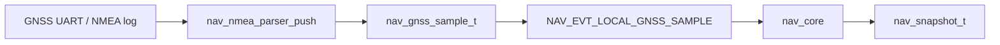

# GNSS NMEA Parser

The portable NMEA parser converts a byte stream into `nav_gnss_sample_t`
records. It is an adapter layer for platform UART readers; it does not own a
UART, file descriptor, task, interrupt, DMA channel, or hardware driver.



## API

Public declarations are in `core/include/nav/nav_nmea.h`:

```c
void nav_nmea_parser_init(nav_nmea_parser_t *parser);
nav_nmea_result_t nav_nmea_parser_push(
    nav_nmea_parser_t *parser,
    uint8_t byte,
    nav_gnss_sample_t *out_sample
);
void nav_gnss_sample_set_time(nav_gnss_sample_t *sample, uint32_t now_ms);
const char *nav_nmea_result_to_string(nav_nmea_result_t result);
```

`nav_nmea_parser_push()` accepts one byte at a time. It ignores noise until `$`,
buffers bytes up to CR/LF, validates the checksum, and emits a sample only when
a supported sentence is complete.

Result values:

- `NAV_NMEA_RESULT_NONE`: no complete sentence yet.
- `NAV_NMEA_RESULT_SAMPLE`: `out_sample` contains a parsed GNSS sample.
- `NAV_NMEA_RESULT_CHECKSUM_ERROR`: checksum was present but did not match.
- `NAV_NMEA_RESULT_UNSUPPORTED_SENTENCE`: checksum was valid, but the sentence
  type is not handled.
- `NAV_NMEA_RESULT_MALFORMED_SENTENCE`: required fields or numeric values were
  invalid.
- `NAV_NMEA_RESULT_OVERFLOW`: the fixed sentence buffer was exceeded.

The parser uses a fixed `NAV_NMEA_MAX_SENTENCE_LEN` buffer and does not use
`malloc`.

## Supported Sentences

Supported talker/sentence pairs:

- `$GPGGA`, `$GNGGA`
- `$GPRMC`, `$GNRMC`

GGA maps:

- latitude/longitude `ddmm.mmmm` / `dddmm.mmmm` plus hemisphere to signed
  `lat_e7` / `lon_e7`
- altitude meters to `alt_mm`
- fix quality to `fix_type` and `valid`
- satellites to `satellites`
- HDOP to `hdop_centi`

GGA fix quality mapping:

- `0`: `NAV_GNSS_FIX_NONE`, `valid=false`
- `1`, `2`: `NAV_GNSS_FIX_3D`, `valid=true`
- `4`: `NAV_GNSS_FIX_RTK_FIXED`, `valid=true`
- `5`: `NAV_GNSS_FIX_RTK_FLOAT`, `valid=true`
- other nonzero values: `NAV_GNSS_FIX_3D`, `valid=true`

RMC maps:

- status `A`: `valid=true`, `NAV_GNSS_FIX_3D`
- status `V`: `valid=false`, `NAV_GNSS_FIX_NONE`
- latitude/longitude when present

RMC speed/course are parsed only for sentence validation context today; the
emitted velocity fields remain zero until the navigation data model needs a
course-derived velocity estimate.

## Timestamp Policy

NMEA UTC time is not used as `nav_gnss_sample_t.timestamp_ms`. In this project,
`timestamp_ms` is the local system/replay time attached to events. The parser
therefore emits samples with `timestamp_ms = 0`; the adapter that receives bytes
from a UART, replay log, or test should stamp the sample with
`nav_gnss_sample_set_time(sample, now_ms)` before wrapping it in
`NAV_EVT_LOCAL_GNSS_SAMPLE`.

## GGA And RMC Interaction

The parser emits one independent `nav_gnss_sample_t` for each supported
sentence. It does not fuse GGA and RMC state internally. A port may choose which
sample to forward or may keep higher-level fusion state outside the parser.
Invalid RMC status does not silently upgrade a fix.

## Checksum And Error Policy

Sentences without a valid `*HH` checksum are rejected. Unsupported sentences with
a valid checksum return `UNSUPPORTED_SENTENCE` and do not reset the stream
permanently. Overlong or malformed sentences reset parser state so the next `$`
can recover the stream.

## Forced-Denied Behavior

Parsed GNSS samples are ordinary `NAV_EVT_LOCAL_GNSS_SAMPLE` inputs. The core
continues to store and log them, but when `demo_force_gps_denied` is true the
snapshot must not use `NAV_SOURCE_LOCAL_GNSS`. Radio navigation or rejection
remains the forced-denied outcome.

## Limitations

- No hardware-to-core ESP-IDF GNSS event adapter is implemented yet. The root
  firmware has GPS UART health reading, while this parser remains portable.
- No u-blox UBX binary parser is implemented.
- No leap-second, date, UTC-to-monotonic, or PPS synchronization logic is
  implemented.
- No velocity vector is derived from RMC speed/course yet.
- No hardware GNSS bring-up or flight-controller output is included.
