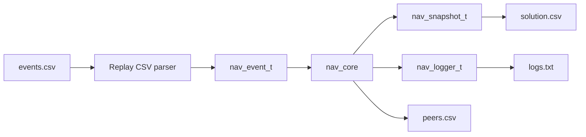

# Replay CSV

Replay makes the navigation core reproducible without real GNSS, radio hardware,
ESP32-S3, STM32, simulator, or flight-controller integration.



The replay runner consumes fixed event rows. It does not generate motion,
random packet loss, noisy ranges, or scenarios. A later simulator will generate
`events.csv`; replay only consumes it.

## Command

```bash
./build/tools/replay/nav_replay \
  --events examples/replay/radio_3d_success/events.csv \
  --out-dir build/replay/radio_3d_success \
  --node-id 0 \
  --pretty
```

Short form:

```bash
./build/tools/replay/nav_replay events.csv output_dir
```

The current replay runner uses default navigation config with
`demo_force_gps_denied=true`, because the existing fixtures exercise radio
navigation.

## Input: events.csv

Required header:

```csv
time_ms,event_type,node_id,peer_id,packet_seq,request_id,lat_e7,lon_e7,alt_mm,vel_n_mmps,vel_e_mmps,vel_d_mmps,fix_type,gnss_valid,satellites,hdop_centi,hacc_mm,vacc_mm,nav_mode,range_mm,range_sigma_mm,rssi_dbm,snr_db,range_valid,alt_source,alt_valid,range_fail_reason
```

Rules:

- `time_ms` and `event_type` are required for every row.
- Unused fields are empty.
- Header row is required.
- Blank lines and lines beginning with `#` are ignored.
- Rows must be in nondecreasing `time_ms` order.
- CSV is simple comma-separated text; quoted fields and multiline fields are not
  supported.
- Unknown event types, invalid enum strings, missing required fields, malformed
  integers, invalid peer lat/lon with valid GNSS, and negative `range_mm` are
  rejected with line-numbered errors.

Supported `event_type` values:

- `TICK`
- `LOCAL_GNSS_SAMPLE`
- `LOCAL_ALTITUDE_SAMPLE`
- `PEER_BEACON_RX`
- `RANGE_RESULT`
- `RANGE_FAIL`

## Event Mapping

`TICK`: uses only `time_ms`; calls `nav_core_tick()`.

`LOCAL_GNSS_SAMPLE`: maps to `NAV_EVT_LOCAL_GNSS_SAMPLE`; uses `node_id`,
position, velocity, `fix_type`, `gnss_valid`, satellites, HDOP, and accuracy
fields.

`LOCAL_ALTITUDE_SAMPLE`: maps to `NAV_EVT_LOCAL_ALTITUDE_SAMPLE`; uses `alt_mm`,
`alt_source`, and `alt_valid`.

`PEER_BEACON_RX`: maps to `NAV_EVT_PEER_TELEMETRY_RX`; uses `nav_peer_beacon_rx_t`
with peer telemetry plus receive metadata `rssi_dbm` and `snr_db`.

`RANGE_RESULT`: maps to `NAV_EVT_RANGE_RESULT`; uses `peer_id`, `request_id`,
`range_mm`, `range_sigma_mm`, `rssi_dbm`, `snr_db`, and `range_valid`.

`RANGE_FAIL`: maps to `NAV_EVT_RANGE_FAIL`; uses `peer_id`, `request_id`, and
`range_fail_reason`.

`packet_seq` is beacon telemetry sequence. `request_id` is ranging correlation.
Replay row order is neither of those.

## Output: solution.csv

One row is emitted after every processed input row.

```csv
time_ms,node_id,nav_mode,solution_status,solution_source,lat_e7,lon_e7,alt_mm,hacc_mm,vacc_mm,num_anchors,anchor0_id,anchor1_id,anchor2_id,residual0_mm,residual1_mm,residual2_mm,residual_rms_m,max_residual_m,geometry_score,anchor_triangle_area_m2,total_quality,reject_reason,altitude_source,local_altitude_valid
```

Enum fields are emitted as strings. `solution_source` is the fastest way to
confirm forced-denied replay did not use local GNSS as the position source.

## Output: peers.csv

One row per present peer is emitted after every processed input row.

```csv
time_ms,local_node_id,peer_id,present,telemetry_age_ms,range_age_ms,packet_seq,request_id,lat_e7,lon_e7,alt_mm,fix_type,gnss_valid,nav_mode,range_mm,range_sigma_mm,range_valid,rssi_dbm,snr_db,telemetry_quality,range_quality,anchor_quality,last_residual_m,reject_reason
```

Empty peer slots are not emitted in this milestone.

## Output: logs.txt

`logs.txt` contains replay lifecycle records plus structured core logs captured
through `nav_logger_t`.

It includes:

- replay start
- each applied event
- parser errors when output logging is available
- core logs
- replay summary

## Fixtures

- `examples/replay/radio_3d_success/events.csv`: final `RADIO_NAV_OK`,
  `RADIO_3D`, source `RADIO_3D`, reject `NONE`.
- `examples/replay/reject_not_enough_anchors/events.csv`: final
  `NOT_ENOUGH_ANCHORS`.
- `examples/replay/reject_missing_altitude/events.csv`: final
  `MISSING_LOCAL_ALTITUDE`.
- `examples/replay/reject_stale_range/events.csv`: final
  `NOT_ENOUGH_ANCHORS`, with logs showing `STALE_RANGE`.
- `examples/replay/reject_bad_position/events.csv`: final
  `NOT_ENOUGH_ANCHORS`, with logs showing `BAD_POSITION`.

Parser-negative fixtures under `examples/replay/parser_invalid_*` are regression
tests for malformed input handling.

## Regression Tests

Run replay tests:

```bash
ctest --test-dir build -V -R replay
```

Replay output is deterministic. Fixture updates should be treated as behavior
changes and reviewed with the same care as core logic changes.

## Current Limitations

- No quoted or multiline CSV fields.
- No config rows yet; replay uses default config plus forced-denied mode.
- No normalized `events_out.csv` yet.
- No Python-reference comparison yet.
- No simulator behavior; replay consumes events only.
