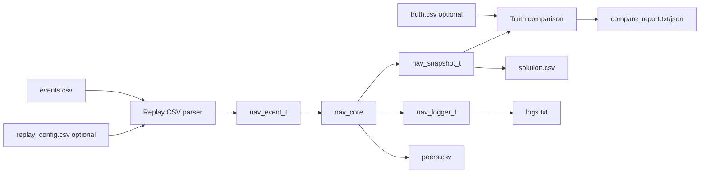

# Replay CSV

Replay makes the navigation core reproducible without real GNSS, radio hardware,
ESP32-S3, STM32, simulator, or flight-controller integration.



The replay runner consumes fixed event rows. It does not generate motion,
random packet loss, noisy ranges, or scenarios. A later simulator will generate
`events.csv`; replay only consumes it.

## Command

```bash
./build/tools/replay/nav_replay \
  --events examples/replay/radio_3d_success/events.csv \
  --truth examples/replay/radio_3d_success/truth.csv \
  --config examples/replay/radio_3d_success/replay_config.csv \
  --out-dir build/replay/radio_3d_success \
  --node-id 0 \
  --pretty
```

Short form:

```bash
./build/tools/replay/nav_replay events.csv output_dir
```

`replay_config.csv` and `truth.csv` are auto-discovered beside `events.csv`
unless `--no-config` or `--no-truth` is used. `--node-id` overrides config file
`node_id`. Without a config file, replay uses default navigation config with
`demo_force_gps_denied=true`, because the current fixtures exercise radio
navigation.

## Input: replay_config.csv

Required header:

```csv
key,value
```

Supported config keys:

- `node_id`
- `telemetry_ttl_ms`
- `range_ttl_ms`
- `local_altitude_ttl_ms`
- `tick_period_ms`
- `max_range_sigma_mm`
- `min_anchor_quality`
- `min_solution_quality`
- `max_residual_rms_m`
- `max_residual_m`
- `min_anchor_triangle_area_m2`
- `degraded_anchor_triangle_area_m2`
- `demo_force_gps_denied`
- `allow_gnss_altitude_in_demo_forced_denied`
- `max_allowed_horizontal_error_m`
- `max_allowed_vertical_error_m`
- `max_allowed_3d_error_m`
- `expect_final_mode`
- `expect_final_solution`
- `expect_final_source`
- `expect_final_reject`

Unknown keys and malformed values are rejected with line-numbered errors. Bool
values accept `true`, `false`, `1`, and `0`. Expected final enum values use the
same strings emitted in `solution.csv`, such as `RADIO_NAV_OK`, `RADIO_3D`,
`REJECTED`, and `NOT_ENOUGH_ANCHORS`.

## Input: events.csv

Required header:

```csv
time_ms,event_type,node_id,peer_id,packet_seq,request_id,lat_e7,lon_e7,alt_mm,vel_n_mmps,vel_e_mmps,vel_d_mmps,fix_type,gnss_valid,satellites,hdop_centi,hacc_mm,vacc_mm,nav_mode,range_mm,range_sigma_mm,rssi_dbm,snr_db,range_valid,alt_source,alt_valid,range_fail_reason
```

Rules:

- `time_ms` and `event_type` are required for every row.
- Unused fields are empty.
- Header row is required.
- Blank lines and lines beginning with `#` are ignored.
- Rows must be in nondecreasing `time_ms` order.
- CSV is simple comma-separated text; quoted fields and multiline fields are not
  supported.
- Unknown event types, invalid enum strings, missing required fields, malformed
  integers, invalid peer lat/lon with valid GNSS, and negative `range_mm` are
  rejected with line-numbered errors.

Supported `event_type` values:

- `TICK`
- `LOCAL_GNSS_SAMPLE`
- `LOCAL_ALTITUDE_SAMPLE`
- `PEER_BEACON_RX`
- `RANGE_RESULT`
- `RANGE_FAIL`

## Event Mapping

`TICK`: uses only `time_ms`; calls `nav_core_tick()`.

`LOCAL_GNSS_SAMPLE`: maps to `NAV_EVT_LOCAL_GNSS_SAMPLE`; uses `node_id`,
position, velocity, `fix_type`, `gnss_valid`, satellites, HDOP, and accuracy
fields.

`LOCAL_ALTITUDE_SAMPLE`: maps to `NAV_EVT_LOCAL_ALTITUDE_SAMPLE`; uses `alt_mm`,
`alt_source`, and `alt_valid`.

`PEER_BEACON_RX`: maps to `NAV_EVT_PEER_TELEMETRY_RX`; uses `nav_peer_beacon_rx_t`
with peer telemetry plus receive metadata `rssi_dbm` and `snr_db`.

`RANGE_RESULT`: maps to `NAV_EVT_RANGE_RESULT`; uses `peer_id`, `request_id`,
`range_mm`, `range_sigma_mm`, `rssi_dbm`, `snr_db`, and `range_valid`.

`RANGE_FAIL`: maps to `NAV_EVT_RANGE_FAIL`; uses `peer_id`, `request_id`, and
`range_fail_reason`.

`packet_seq` is beacon telemetry sequence. `request_id` is ranging correlation.
Replay row order is neither of those.

## Output: solution.csv

One row is emitted after every processed input row.

```csv
time_ms,node_id,nav_mode,solution_status,solution_source,lat_e7,lon_e7,alt_mm,hacc_mm,vacc_mm,num_anchors,anchor0_id,anchor1_id,anchor2_id,residual0_mm,residual1_mm,residual2_mm,residual_rms_m,max_residual_m,geometry_score,anchor_triangle_area_m2,total_quality,reject_reason,altitude_source,local_altitude_valid
```

Enum fields are emitted as strings. `solution_source` is the fastest way to
confirm forced-denied replay did not use local GNSS as the position source.

## Output: peers.csv

One row per present peer is emitted after every processed input row.

```csv
time_ms,local_node_id,peer_id,present,telemetry_age_ms,range_age_ms,packet_seq,request_id,lat_e7,lon_e7,alt_mm,fix_type,gnss_valid,nav_mode,range_mm,range_sigma_mm,range_valid,rssi_dbm,snr_db,telemetry_quality,range_quality,anchor_quality,last_residual_m,reject_reason
```

Empty peer slots are not emitted in this milestone.

## Output: logs.txt

`logs.txt` contains replay lifecycle records plus structured core logs captured
through `nav_logger_t`.

It includes:

- replay start
- each applied event
- parser errors when output logging is available
- core logs
- replay summary

## Input: truth.csv

Required header:

```csv
time_ms,node_id,true_lat_e7,true_lon_e7,true_alt_mm,true_vn_mmps,true_ve_mmps,true_vd_mmps
```

Rules:

- `time_ms`, `node_id`, `true_lat_e7`, `true_lon_e7`, and `true_alt_mm` are
  required.
- Velocity fields may be empty.
- Header row is required.
- Blank lines and lines beginning with `#` are ignored.
- Malformed rows are rejected with line-numbered errors.
- Matching uses exact `(time_ms,node_id)` rows only. There is no interpolation.

Truth is comparison input. Replay does not generate truth; the future simulator
may generate both `events.csv` and `truth.csv`.

## Output: compare_report.txt/json

When truth is available, replay compares only solution rows where:

- `solution_status == RADIO_3D`
- `solution_source == RADIO_3D`
- an exact truth row exists for the same `time_ms` and `node_id`

Report fields:

```text
rows_compared
rows_skipped_no_truth
rows_skipped_no_radio_solution
max_horizontal_error_m
rms_horizontal_error_m
max_vertical_error_m
rms_vertical_error_m
max_3d_error_m
rms_3d_error_m
max_allowed_horizontal_error_m
max_allowed_vertical_error_m
max_allowed_3d_error_m
pass
```

Thresholds come from `replay_config.csv` and default to `1.0 m` for horizontal,
vertical, and 3D max error. If no truth data is available, replay succeeds and
logs `truth_compare skipped=1 reason=NO_TRUTH`; no compare report is created.

## Fixtures

- `examples/replay/radio_3d_success/events.csv`: final `RADIO_NAV_OK`,
  `RADIO_3D`, source `RADIO_3D`, reject `NONE`; includes `truth.csv`.
- `examples/replay/reject_not_enough_anchors/events.csv`: final
  `NOT_ENOUGH_ANCHORS`.
- `examples/replay/reject_missing_altitude/events.csv`: final
  `MISSING_LOCAL_ALTITUDE`.
- `examples/replay/reject_stale_range/events.csv`: final
  `NOT_ENOUGH_ANCHORS`, with logs showing `STALE_RANGE`.
- `examples/replay/reject_bad_position/events.csv`: final
  `NOT_ENOUGH_ANCHORS`, with logs showing `BAD_POSITION`.

Parser-negative fixtures under `examples/replay/parser_invalid_*` are regression
tests for malformed event, config, and truth input handling.

Rejection fixtures may end with aggregate final reject reasons such as
`NOT_ENOUGH_ANCHORS` while the root cause for a specific peer is visible in
`peers.csv` or `logs.txt`, for example `STALE_RANGE` or `BAD_POSITION`.

## Adding A Fixture

1. Create `examples/replay/<name>/events.csv`.
2. Add `replay_config.csv` with expected final fields.
3. Add `truth.csv` if the fixture has expected positions to compare.
4. Add or update a CTest entry in `tests/CMakeLists.txt`.
5. Run `ctest --test-dir build -V -R replay`.

Keep fixture rows deterministic. Replay does not belong to the simulator layer.

## Python Reference Comparison

The optional helper compares a replay solution with the validated Python
trilateration project:

```bash
python tools/replay/compare_with_trilat_reference.py \
  --events examples/replay/radio_3d_success/events.csv \
  --solution build/replay/radio_3d_success/solution.csv \
  --trilat-root ~/projects/trilateration
```

It imports `~/projects/trilateration/src/trilateration/solver.py`. If the
reference project `.venv` exists, the helper re-runs itself through that venv
once. If dependencies are still unavailable, it exits with a clear
`REFERENCE_COMPARE_ERROR`.

## Regression Tests

Run replay tests:

```bash
ctest --test-dir build -V -R replay
```

Replay output is deterministic. Fixture updates should be treated as behavior
changes and reviewed with the same care as core logic changes.

## Current Limitations

- No quoted or multiline CSV fields.
- No normalized `events_out.csv` yet.
- No interpolation for `truth.csv`.
- No simulator behavior; replay consumes events only.
