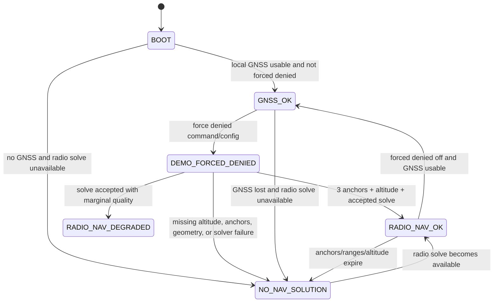

# State Machine

## Mode Rules

- `GNSS_OK`: local GNSS is usable and `demo_force_gps_denied` is false.
- `DEMO_FORCED_DENIED`: local GNSS may be logged as truth/debug, but it is not
  used as the position source.
- `RADIO_NAV_OK`: three anchors, fresh local altitude, acceptable geometry, and
  trilateration succeeded with acceptable quality.
- `RADIO_NAV_DEGRADED`: solution exists, but v1 quality or geometry is below the
  preferred threshold while still above the hard reject threshold.
- `NO_NAV_SOLUTION`: no accepted local or radio solution is available.

`GPS_DENIED` and `GNSS_SUSPECT` remain reserved for richer GNSS health logic.
The current forced-denied path is enough for deterministic radio navigation
tests and demos.
